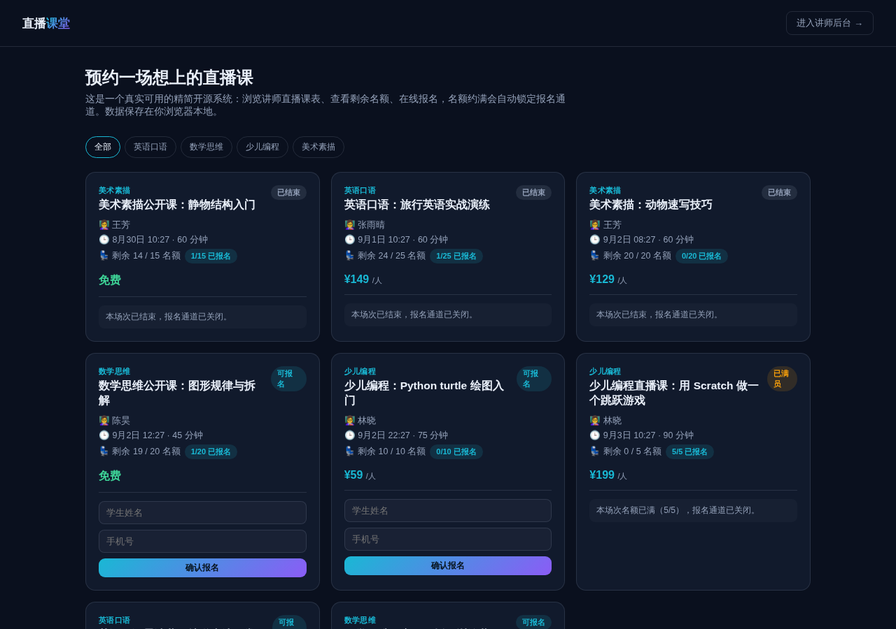

# 在线教育直播排课系统（精简开源版）· EduLive Lite

**[在线体验（前台）→](https://anna123123123-creator.github.io/edulive-lite/)** · **[讲师后台 →](https://anna123123123-creator.github.io/edulive-lite/admin.html)**

免费开源的在线教育直播排课系统精简版。这不是截图或原型图，是一个**真实可用**的前后台系统：直播场次浏览、在线报名、容量满员自动锁定报名通道，后台课程表增删改查、报名与签到管理、数据看板——都是真功能，纯前端 + `localStorage` 实现，不需要服务器、不需要数据库，克隆下来打开就能用，也适合作为学习或二次开发的起点。

和"买断式、随时看"的录播课平台不同，这里强调的是**有固定开课时间、有名额上限**的直播场次——更接近"预约一节直播课的座位"，而不是"购买一门课程"。



## 功能

**前台（学生视角）**
- 直播场次列表浏览，按科目筛选
- 每个场次展示讲师、开课时间、时长、价格、剩余名额
- 只有"可报名"（未满员、未开始）的场次才会显示报名表单
- 在线提交报名，自动校验：姓名/手机号必填、手机号格式，以及提交时**实时重新核对名额**——如果场次在你填表期间被别人报满，会拒绝报名并给出明确提示，不会出现超额报名
- 报名成功后剩余名额立即刷新，无需刷新页面

**后台（讲师/运营视角）**
- 仪表盘：场次总数、待开课场次数、累计报名人次、本月报名收入（按场次单价实时计算，只统计付费场次且开课时间在本月内的报名）、即将开始的场次一览
- 课程表管理：新增、编辑、删除直播场次（讲师、标题、科目、开课时间、时长、容量、价格），删除场次会同步删除其下所有报名记录
- 报名管理：按场次查看已报名学生名单，可切换"已签到 / 未签到"

## 试用方法

克隆下来，直接用浏览器打开 `index.html`，或用静态文件服务器跑起来：

```bash
python3 -m http.server 8000
```

前台在 `index.html`，后台在 `admin.html`。所有数据存在浏览器的 `localStorage` 里（`edulive_lite_data_v1` 这个 key），后台侧边栏有"重置示例数据"按钮可以随时清空重来。

## 技术说明

没有用任何框架或构建工具，纯原生 HTML/CSS/JavaScript，一共 5 个文件：`data.js`（数据层，负责 localStorage 读写、种子数据和场次状态/名额计算）、`index.html` + `script.js`（前台）、`admin.html` + `admin.js`（后台）。

这是一个演示排课与报名逻辑的 Demo，**不包含真实的音视频直播/推流基础设施**——它只管理"排课与报名"这一层，不负责真正把视频流推给学生。因为是纯前端 Demo，数据只存在当前浏览器里，不同设备/浏览器之间不会同步。真实生产系统需要：一个后端 API + 数据库来替换 `data.js` 里的存储层、真实的直播推流/连麦服务（如 RTC/CDN 推流方案）、以及真实的支付网关，界面和排课/报名交互逻辑基本可以直接复用。

## 协议

MIT，随便怎么用都行。

## 相关项目

这是完整版**在线教育直播排课系统**的精简开源示例——完整版支持真实互动直播推流与连麦、录播回放与讲义资料库、多终端签到与学情分析、真实支付与退课结算，源码在这：[全能源码 · 在线教育直播排课系统源码](https://inzyxuashop.com/jiaoyuzhibo-yuanma.html)。
